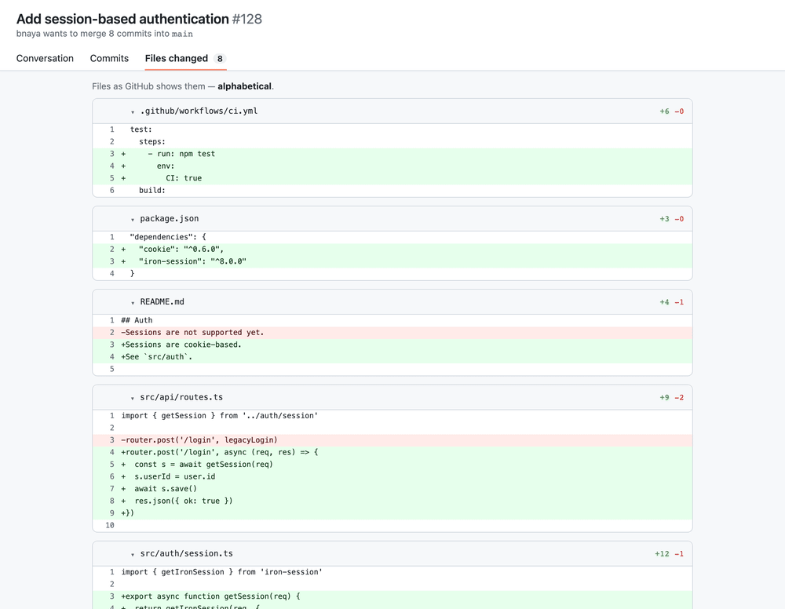

# PR Review Sorter

A tiny Chrome extension that lets a **code agent decide the order you read a PR in**.

GitHub shows a PR's changed files alphabetically. That's rarely the order that makes
a review easy. This extension reads a review order the agent encoded in the PR URL and
reorders the "Files changed" list to match — entry points first, tests and docs last —
with a numbered badge on each file and a clickable order panel.

The agent can also **highlight specific lines and drop inline comments** to walk you
through the diff — all encoded in the same link, no API and no server.



## How it works

1. A code agent (Claude, etc.) looks at a PR and picks a sensible reading order, a short reason per file, and — optionally — highlights key lines with inline comments.
2. It encodes all of that into the PR's files URL as a query param.
3. You open the link. The extension reorders the diff, numbers each file, shows the order panel, and draws the highlights + comments inline.

The agent needs no API and no server — it just builds a URL. The contract is one query param.

## Install (unpacked)

1. `git clone https://github.com/BnayaZil/pr-review-sorter.git`
2. Open `chrome://extensions`, turn on **Developer mode**.
3. **Load unpacked** → select the `extension/` folder.
4. Open any `…/pull/<n>/files?pr_order=…` link.

## The URL contract

Append one of these to a PR's **files** URL (`https://github.com/<owner>/<repo>/pull/<n>/files`):

| Param | Value | Carries reasons? |
|-------|-------|------------------|
| `pr_order` | base64url of `{"v":1,"files":[{"p":"path","r":"reason"}]}` | yes |
| `pr_order_paths` | comma-separated, each `encodeURIComponent(path)` | no |

Either may live in the query string (`?…`) or the hash (`#…`). Files the agent leaves
out still show, kept after the ordered ones; paths that aren't in the PR are greyed out
in the panel.

Build a `pr_order` token in one line:

```bash
node -e 'const f=[{p:"src/index.ts",r:"entry point"},{p:"src/core.ts",r:"main logic"}];
process.stdout.write(Buffer.from(JSON.stringify({v:1,files:f})).toString("base64url"))'
```

### Highlights + inline comments

Give any file a `notes` array to highlight lines and attach the agent's comments:

```json
{ "v": 1, "files": [
  { "p": "src/index.ts", "r": "entry point",
    "notes": [ { "l": 42, "t": "session middleware must run before routes" } ] },
  { "p": "src/api/routes.ts", "r": "the API surface",
    "notes": [ { "f": 10, "to": 18, "t": "new login handler — is `user` in scope?" } ] }
] }
```

| Note field | Meaning |
|------------|---------|
| `l` | a single line number (diff gutter) |
| `f` + `to` | a line range |
| `s` | side: `"R"` new/added (default) or `"L"` old |
| `t` | the comment text |

## The agent skill

[`skill/SKILL.md`](skill/SKILL.md) is a short [Agent Skill](https://docs.claude.com/en/docs/claude-code/skills)
that teaches an agent the whole flow: list files, order them for a human, build the link.
To use it with Claude Code, drop the folder into `~/.claude/skills/pr-review-sorter/`
(or your project's `.claude/skills/`). Then: *"review PR 128 and give me a sorted link."*

## Try the demo

Open [`demo/demo.html`](demo/demo.html) in a browser — it mimics a real GitHub PR page
(same DOM classes) and animates the reorder using the extension's own code. It's also
what the gif above is recorded from.

## Repo layout

| Path | What |
|------|------|
| `extension/` | The Chrome extension (MV3): `manifest.json`, `content.js`, `styles.css`, `icons/` |
| `skill/SKILL.md` | The agent skill explaining the integration |
| `demo/` | Self-contained demo page used for the gif |
| `scripts/` | `build-gif.mjs`, `make-icons.mjs` (Playwright + ffmpeg) |
| `assets/demo.gif` | The demo recording |

## Rebuild the gif / icons

```bash
npm i playwright && npx playwright install chromium   # ffmpeg also required
node scripts/make-icons.mjs
node scripts/build-gif.mjs
```

## License

MIT — see [LICENSE](LICENSE).
